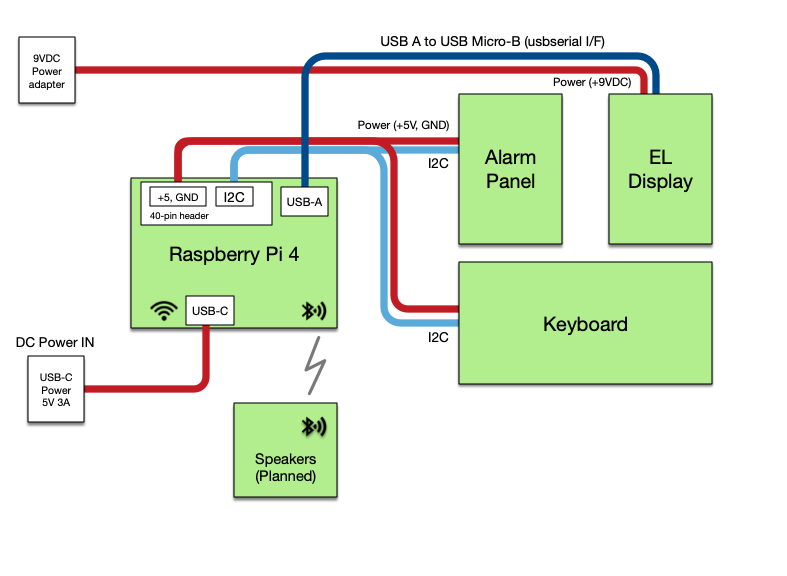

## Board Cabling

### Four-wire Interconnections

A simple four-wire bus is used to interconnect the Raspberry Pi Power daughter board, the Keyboard assembly, and the Alarm Panel assembly.

| Signal          | Insulator Color   |
| --------------- | -----------  |
| +5VDC           | RED          |
| Ground          | GREEN        |
| I2C Data (SDA)  | BLUE         |
| I2C Clock (SCL) | YELLOW       |

Because of the small clearances at the Keyboard once installed, I find it easier to solder two sets of these four wire groups to the keyboard and then route one set to the Pi and one set to the Alarm Panel assembly.

### Display Assembly connections

Your choice of the EL or LED Display Panel assembly both connect in a different way: data is passed via a USB-A to USB-Micro-B cable.  Separate power is supplied by a +3.3V/GND pair originating at the Pi-Power daughter board for the Raspberry Pi.  This separate source is required as the Raspberry Pi USB connection is unable to supply sufficient current for some operating conditions.

## 3D Printing Components

How can you get the best results 3D printing the hardware components?  Of available 3D printing technologies, I find that Selective Laser Sintering (SLS) of the parts in Nylon 12 gives -- by far -- the best results for the price.  Nearly all parts in my project were printed in this manner.  I farmed out my SLS printing to [Xometry](https://www.xometry.com/) for this project.

### Bill Of Materials

| Order Qty | Part           | 3D Print Process |
|----| --------------- | --------------  |
|1| [2004918B-inserts-HOUSING, FRONT](https://github.com/rrainey/DSKY-matic/blob/master/hardware/2004918B-inserts-HOUSING%2C%20FRONT.step)  | SLS     |
|1| [2004929-exact-COVER, FRONT](https://github.com/rrainey/DSKY-matic/blob/master/hardware/2004929-exact-COVER%2C%20FRONT.step)       | SLS     |
|1| [2004919E-inserts-PLATE, ADAPTER](https://github.com/rrainey/DSKY-matic/blob/master/hardware/2004919E-inserts-PLATE%2C%20ADAPTER.step)  | SLS     |
|2| [1006351A-exact-GASKET](https://github.com/rrainey/DSKY-matic/blob/master/hardware/1006351A-exact-GASKET.step)  | SLS     |
|1| [Alarm Panel replica assembly](https://github.com/rrainey/DSKY-alarm-panel-replica) | -   |
|1| [Keyboard replica assembly](DSKY-keyboard-replica) | -    |
|1| [EL Display replica assembly](https://github.com/rrainey/DSKY-digital-indicator-replica) | -    |
|1| [Pi-Power daughter board assembly](https://github.com/rrainey/Pi-Power) | -    |
|1| [Raspberry Pi Mount](https://github.com/rrainey/DSKY-matic/blob/master/hardware/pi-mount.step) | SLS, PLA, or ABS    |
|1| [Display base, left arm](https://github.com/rrainey/DSKY-matic/blob/master/hardware/left-base.step) | SLS, PLA, or ABS    |
|1| [Display base, right arm](https://github.com/rrainey/DSKY-matic/blob/master/hardware/right-base.step) | SLS, PLA, or ABS    |
|1| [Power Supply Module, 100-240V 50/60Hz, Output: 9V@3.5A; TRIAD P/N: WSU090-3500](https://github.com/rrainey/DSKY-matic/blob/master/hardware/right-base.step) | -    |
|1| [Raspberry Pi 4B 4 or 8GB](https://www.raspberrypi.com/products/raspberry-pi-4-model-b/) | -    |
|1| [Insert: 4-40 Internal Thread Size, Item # 1GPL4 (package of 100)](https://www.grainger.com/product/GRAINGER-APPROVED-Ultrasonic-Insert-4-40-Internal-1GPL4) | -    |
|1| [Insert: M2.5 Internal Thread Size, Item # 1GRL4 (package of 100)](https://www.grainger.com/product/GRAINGER-APPROVED-Ultrasonic-Insert-M2-5-x-0-1GRL4) | -    |

NOTE: This BOM is currently incomplete, it does not list all required cable assemblies, inserts, or fasteners.