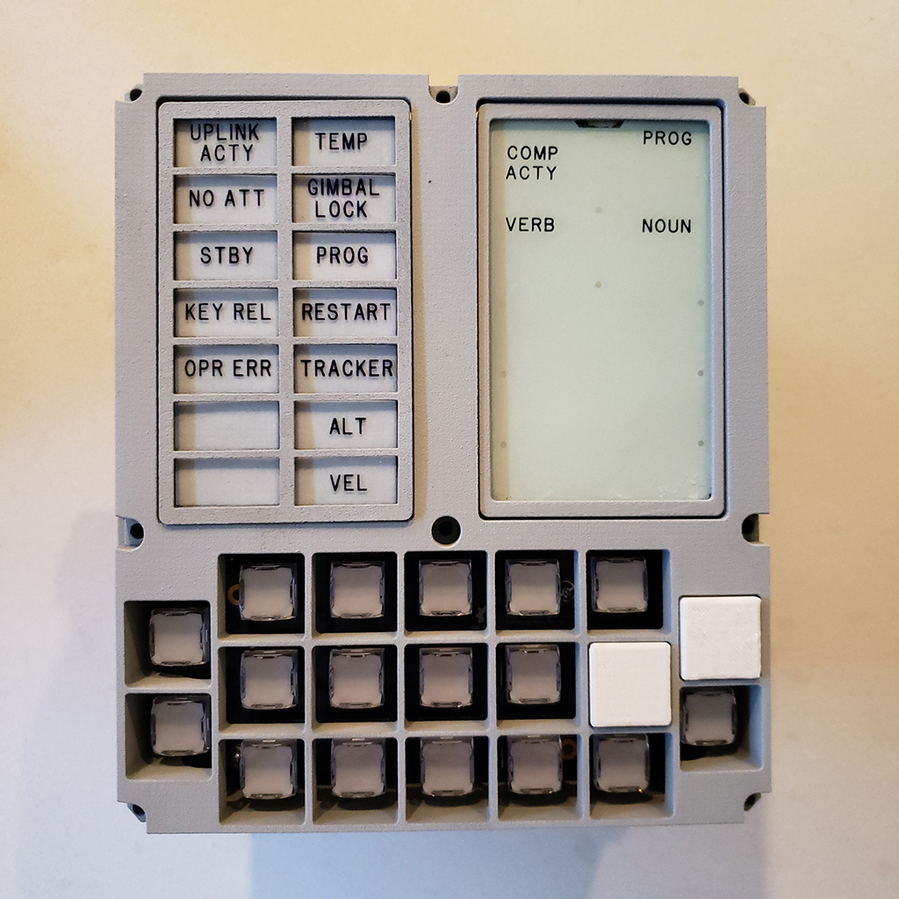
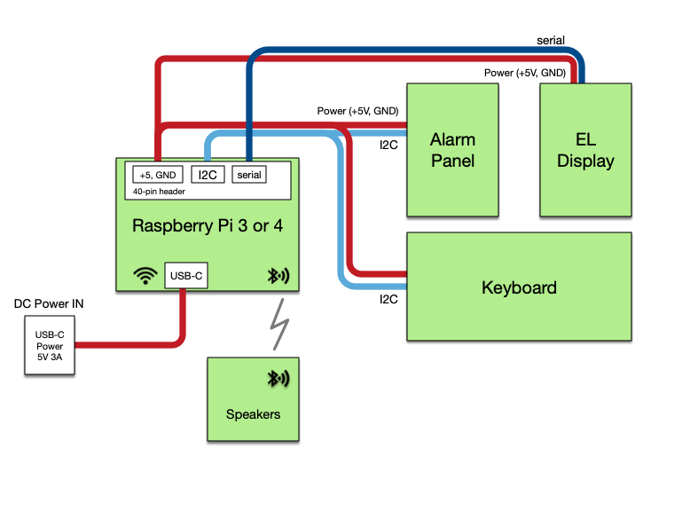

# The DSKY-matic Project
A Functioning Apollo DSKY Replica - November 2020

### Why is it called "DSKY-matic"?

Because *"Riley Rainey's Apollo Guidance Computer DSKY Replica Project"* doesn't really roll off the tongue.

Naming a project is often difficult. In this case it's especially hard: the Apollo Guidance Computer has inspired many replica projects. This effort was almost entirely for my own gratification. I wanted to create a replica of the original DSKY that was faithful to the original look and feel. And I wanted to be able to interact with it.  I named it **DSKY-matic** to tag it with an easy name distinguishing it from other projects.

DSKY-matic is an open project so that anyone can reproduce the work or build upon my results.

### Project Status

Work on the Alarm Panel project is largely complete. The final version of the latest Keyboard PCB remains to be tested, but the V2 board is operating. I2C interfaces and drivers have been sucessfully tested with Raspberry 4 hardware.

Major to-dos:

* build a new batch of EL Driver boards - I blew out the first driver board while testing a bad E/L display stack
* develop Virtual AGC-friendly hardware drivers for each I/O board
* adapt Virtual AGC to use these Lamp, Keyboard, and Display drivers
* validate using the Pi's USB-C interface to power the whole project
* improve the keyboard's pushbutton design - the current version is a rather clunky 3D printed design that could look much more realistic

### Components and cloning this project

The Electroluminescent Display, Alarm Panel, and     Keyboard are each modular components. They are driven by a
  Raspberry Pi 4 to simulate the AGC, but each could be swapped out with equivalent redesigns.

The hardware and firmware for each major component are grouped into three git submodules. You will need to follow some specific steps to clone the entire tree on your local machine. First, clone this repository:

        $ git clone https://github.com/rrainey/DSKY-matic.git

Go into the project folder:

        $ cd DSKY-matic

Now clone all submodules:

        $ git submodule update --init --recursive --remote

### Directory Structure

* **hardware** - 3D-printable frame components designed using Fusion 360. STEP and the original Fusion source files are provided. Hardware models used in thie replica were derived from models found in the [AGC Mechanical CAD project](https://github.com/rrainey/agc-mechanical-cad).

* **software** - software components designed to run on the projects embedded Raspberry Pi 3/4.  This siftware is a Apollo Guidance Computer virtual machine interfacing to the deisplays and keyboard via I2C and serial communications drivers.

### Credits

This work would not have been possible without the generous and open work of these projects:

* [The Virtual AGC Project](https://www.ibiblio.org/apollo/) -- Ron Burkey and others have worked for years to build software emulator of the AGC hardware, supporting developments tools, a collection of original NASA and MIT documents, as well as an archive of transcribed original CM and LEM programs.
* [Adafruit Industries](https://www.adafruit.com/) -- Lady Yada and others have produced a great line of hobbyist microcontrollers and supporting programming tools. They deserve your support.
* [The Raspberry Pi Foundation](https://www.raspberrypi.org/about/) -- The Raspberry Pi Foundation is a UK-based charity that is the source fabulous Linux-compatible low-cost computers.

## DSKY-matic License

Creative Commons Attribution/Share-Alike, all text above must be included in any redistribution. See license.txt for additional details.

## My Background

My name is Riley Rainey. I'm a software developer by profession. I spent a number of years building aerospace simulations as my day job.

## Getting Support

There's no official support available, but you can [leave comments or create an issue](https://github.com/rrainey/DSKY-alarm-panel-replica/issues) in this GitHub project.

  
This work is licensed under a [Creative Commons Attribution-ShareAlike 4.0 International License](http://creativecommons.org/licenses/by-sa/4.0/).