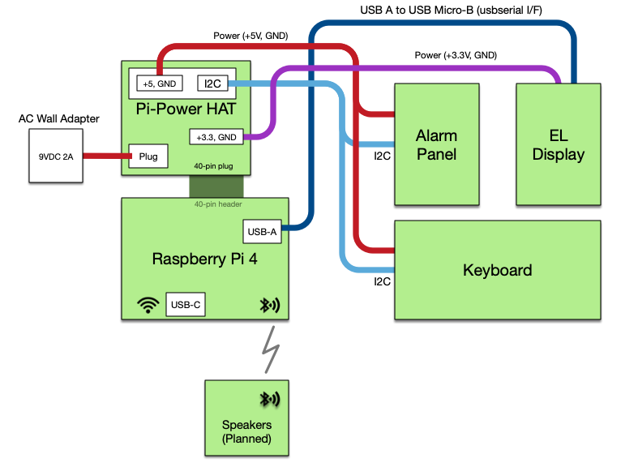

# The DSKY-matic Project
A Functioning Apollo DSKY Replica - October 2021

## Introduction

The Apollo Guidance Compuer (AGC) is one of the critical inventions that made the U.S. moon landings possible. AGC's were installed in both the Apollo Command Module and Lunar Module. MIT and NASA archives, as well as important contributions from researchers have given us a rich set of detail about how this computer was constructed.

Space and computer enthusiasts like me from all over the world have enjoyed exploring this work from the early space era.

### Why is this project called "DSKY-matic"?

Because *"Riley Rainey's Apollo Guidance Computer DSKY Replica Project"* doesn't really roll off the tongue.


Naming a project is often difficult. In this case it's especially hard: the Apollo Guidance Computer has inspired many replica projects. I wanted to create a replica of the DSKY that was faithful to the original look and feel. And I wanted to be able to interact with it.  I came up with **DSKY-matic** to tag it with an easy name distinguishing it from other projects.

DSKY-matic is an open project so that anyone can reproduce the work or build upon my results.


### Components and cloning this project

The EL or LED Displays, Alarm Panel, and Keyboard are each modular components. They are driven by a
  Raspberry Pi 4 to simulate the AGC, but each could be swapped out with equivalent redesigns. A
  Power Supply Hat mates with the Raspberry Pi 4 to distribute +5V and +3.3V power to all boards.



You will find more information about interconnections and cabling in [this document](ASSEMBLY.md)

### Project Status

Hardware work is complete. I'm working on a distributable version of the full simulator software.

Major to-dos:

* [**complete**] adapt Virtual AGC to use these Lamp, Keyboard, and Display drivers
* [**complete**] improve the keyboard's pushbutton design - the current version is a rather clunky 3D printed design that could look much more realistic
* [**complete**] design and test an alternative to the original Electroluminescent Display module. This alternate assembly uses LEDs in place of the EL display.  It's easier to build and may be more reliable over time - if not as cool.
* [**complete**] build and test batch of the revised (current limited) EL Driver boards
* [**complete**] test fully integrated DSKY hardware and software driver configuration
* [**in progress**] Integrated AGC and spacecraft simulator software

### Cloning

The hardware and firmware for each major component is segregated into git submodules. You will need to follow some specific steps to clone the entire tree on your local machine. First, clone this repository:

        $ git clone https://github.com/rrainey/DSKY-matic.git

Go into the project folder:

        $ cd DSKY-matic

Now clone all submodules:

        $ git submodule update --init --recursive --remote

### Directory Structure

* **hardware** - 3D-printable frame components designed using Fusion 360. STEP and the original Fusion source files are provided. Hardware models used in thie replica were derived from models found in the [AGC Mechanical CAD project](https://github.com/rrainey/agc-mechanical-cad).

* **src** - software components designed to run on the project's embedded Raspberry Pi 4.  This software is a Apollo Guidance Computer virtual machine interfacing to the displays and keyboard via I2C and USB serial communications drivers.

* **DSKY-alarm-panel-replica** - definition of the Alarm Panel hardware and software assembly

* **DSKY-digital-indicator-replica** - definition an alternative to the EL Display Panel; this variant is based on LEDs

* **DSKY-keyboard-replica** - definition of the Keyboard hardware and software assembly

* **Pi-Power** - power supply hat for the Raspberry Pi 4

* **virtualagc** - Ron Burkey's Virtual AGC software; runs on the Raspberry Pi 4 in this implementation

## Arduino-based Drivers

The custom hardware boards that are part of this project all run Arduino-based firmware on ATSAMD21 processors.

### Configuring Boards

The peripheral boards for DSKY-matic run Arduino-based software. When you have a board ready for software installation, you'll use the Arduino IDE to build and install the driver onto a board. Custom DSKY-matic Arduino board definitions help with this process.

There's a few steps leading up to this installation that you'll need to follow first:

1. **Build bootloaders for each board** - these bootloaders are used to install Arduino firmware drivers on each board

```
git clone https://github.com/rrainey/uf2-samdx1
cd uf2-samdx1
make BOARD=dskydisplay_led_m0
make BOARD=dskyalarm_m0
make BOARD=dskykeyboard_m0
```

These steps will build bin and uf2 files in a `build` subfolder.

2. **Install the bootloader** - Bootloaders can be installed by following the procedure outlined in this [Adafruit article](https://learn.adafruit.com/how-to-program-samd-bootloaders). The DSKY-matic Keyboard and LED Display boards are equipped with ATSAMD JTAG/SWD connectors.  Those boards can have the bootloader installed directly using a SEGGER J-Link Edu Mini interface as described in the article.  For the Alarm board, I followed Ben's technique of cannibalizing
  the SAMD processor from a Trinket M0 to install on the board.  The advantage there is that the bootloader is already installed.  You can follow that approach as well, or connect the SWD line up directly and program via a SEGGER interface too.

3. **Install the Arduino IDE** -
Install the Arduino IDE. I'm currently using version 1.8.13.

4. **Install the Arduino board definitions** -
These must be installed in your Arduino IDE. An excellent guide to this process is described at this [Adafruit help page](https://learn.adafruit.com/add-boards-arduino-v164/setup). At the point in the steps where you are supplying "Additional Boards Manager URLs" use this URL: `https://github.com/rrainey/ArduinoCore-samd/releases/download/x1.0.0/package_rrainey_dskymatic_index.json`

5. **Connect a board via USB, Build and install the appropriate firmware driver** -- I'll add more detailed instructions here soon, but the firmware is located in the GitHub repo for each board project.

### Sound setup on the Raspberry Pi 4

There's a bit of set up required to play sound from the ALSA drivers. The aplay and
amixer commands are used here to set the volume from the command line:

<pre>
<b>$ aplay -L</b>
null
    Discard all samples (playback) or generate zero samples (capture)
pulse
    Playback/recording through the PulseAudio sound server
sysdefault:CARD=ALSA
    bcm2835 ALSA, bcm2835 ALSA
    Default Audio Device
<b>$ amixer</b>
Simple mixer control 'Master',0
    Capabilities: pvolume pswitch pswitch-joined penum
    Playback channels: Front Left - Front Right
    Limits: Playback 0 - 65536
    Mono:
    Front Left: Playback 65536 [100%] [on]
    Front Right: Playback 65536 [100%] [on]
Simple mixer control 'Capture',0
    Capabilities: cvolume cswitch cswitch-joined penum
    Capture channels: Front Left - Front Right
    Limits: Capture 0 - 65536
    Front Left: Capture 0 [0%] [on]
    Front Right: Capture 0 [0%] [on]
<b>$ amixer controls</b>
numid=4,iface=MIXER,name='Master Playback Switch'
numid=3,iface=MIXER,name='Master Playback Volume'
numid=2,iface=MIXER,name='Capture Switch'
numid=1,iface=MIXER,name='Capture Volume'
<b>$ amixer cset numid=3 50%</b>
numid=3,iface=MIXER,name='Master Playback Volume'
  ; type=INTEGER,access=rw------,values=2,min=0,max=65536,step=1
  : values=32768,32768
</pre>


### Credits

This project would not have been possible without the generous and open work of these projects:

* [The Virtual AGC Project](https://www.ibiblio.org/apollo/) -- Ron Burkey and others have worked for years to build software emulator of the AGC hardware, supporting developments tools, a collection of original NASA and MIT documents, as well as an archive of transcribed original CM and LEM programs.
* [Adafruit Industries](https://www.adafruit.com/) -- Lady Yada and others have produced a great line of hobbyist microcontrollers and supporting programming tools. They deserve your support.
* [The Raspberry Pi Foundation](https://www.raspberrypi.org/about/) -- The Raspberry Pi Foundation is a UK-based charity that is the source fabulous Linux-compatible low-cost computers.

## DSKY-matic License

Software components (everything in "./src") are licensed under the GPL v2. All other elements are covered 
under Creative Commons Attribution/Share-Alike, all text above must be included in any redistribution. See license.txt for additional details.

## My Background

My name is Riley Rainey. I'm a software developer by profession. I spent a number of years building aerospace simulations as my day job.

## Getting Support

There's no official support available, but you can [leave comments or create an issue](https://github.com/rrainey/DSKY-alarm-panel-replica/issues) in this GitHub project.


[](http://creativecommons.org/licenses/by-sa/4.0/)  
This work is licensed under a [Creative Commons Attribution-ShareAlike 4.0 International License](http://creativecommons.org/licenses/by-sa/4.0/).
